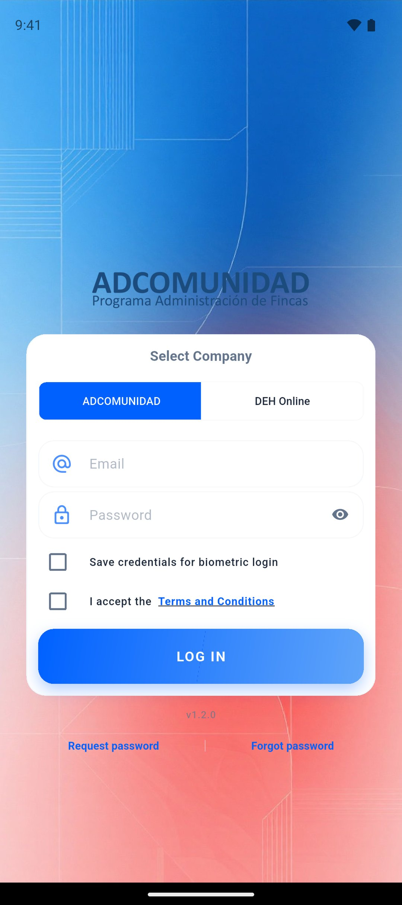
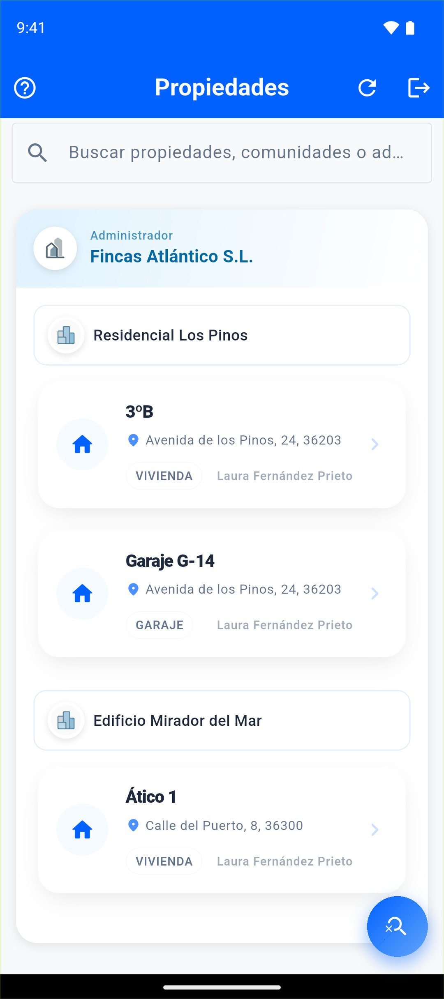
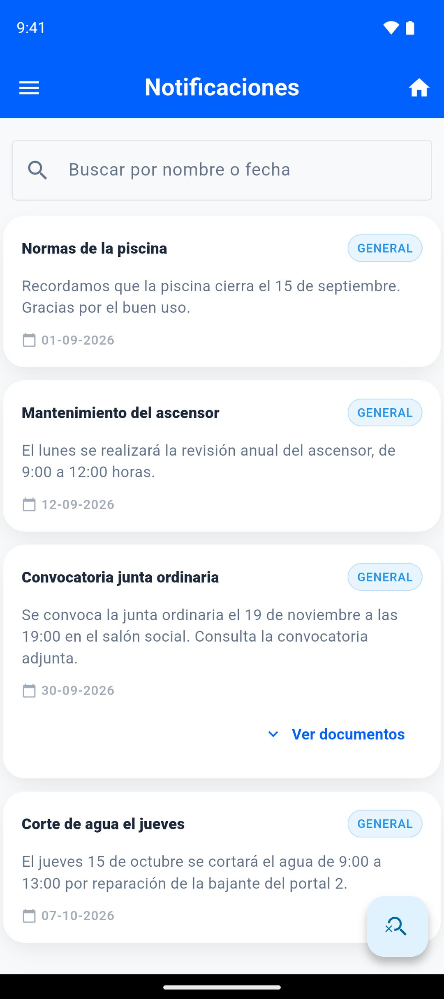
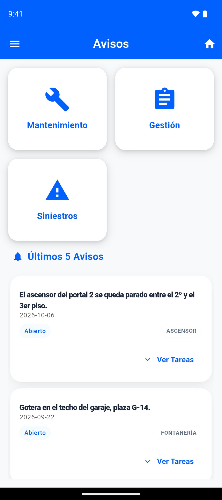
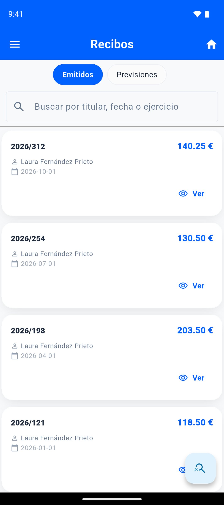
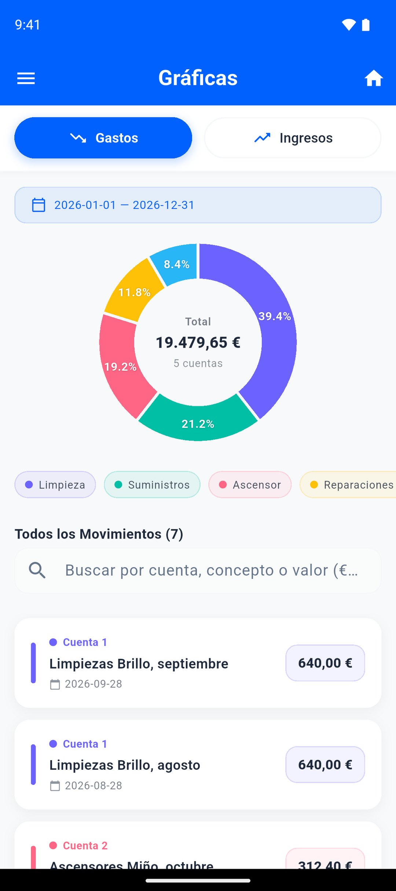
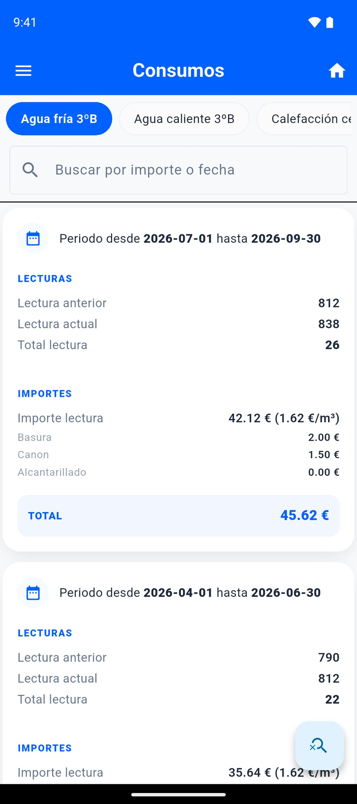
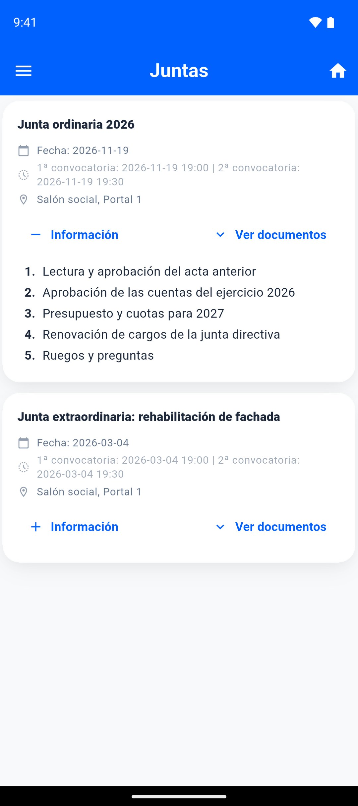
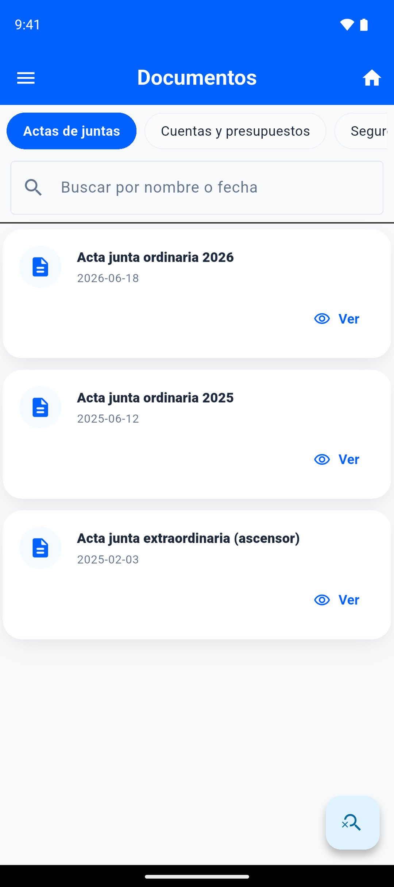

# ADCOMUNIDAD Propietarios

Flutter mobile app (Android) for homeowners to manage their community of neighbors, built for the ADSOLUCIONES platform used by many property-management firms.

> The source code is private (property of the company), so this repository only contains a summary and screenshots taken from the real app running with invented demo data. The app is public on [Google Play](https://play.google.com/store/apps/details?id=com.adcomunidad.app_propietarios).

  
  
  
  
  
  
  
  
  

## What it does

- Properties, notices, receipts and accounting: movements, budgets, fiscal years and charts.
- Meetings, board of directors, contracts, documents (PDF viewer) and contacts with the administrator.
- Consumption readings.
- Push notifications by topic.
- Biometric login and a font-size selector.
- 7 languages: Spanish, Catalan, Galician, Basque, English, German and Portuguese, with in-app updates.
- Adapts to the management company of each user.

## My role

I designed and developed the app on my own, end to end: architecture, UI, accessibility, behavior, optimization and publication on Google Play (signing, versions and updates). The business features were defined by the company and I turned them into product.

## Technical highlights

- **Clean Architecture** with one BLoC per feature and dependency injection with GetIt. Errors travel as translatable keys, not as text.
- **Shared design system** (palettes, spacing, reusable components) kept in sync between the two ADCOMUNIDAD apps with an in-house tool.
- **Push notifications (FCM)** subscribed by topic, covering foreground, background and closed-app states.
- **Accessibility:** adjustable font size across the app, and a layout test that renders every screen on a small phone at 1.5x text, light and dark, and fails on any overflow.
- **Performance:** a single HTTP client with connection pooling, timeouts and error mapping.

## Stack

Flutter and Dart · flutter_bloc · GetIt · Clean Architecture · Dio / http · Firebase Cloud Messaging · flutter_secure_storage · local_auth · intl (ARB localizations) · mockito and bloc_test.
